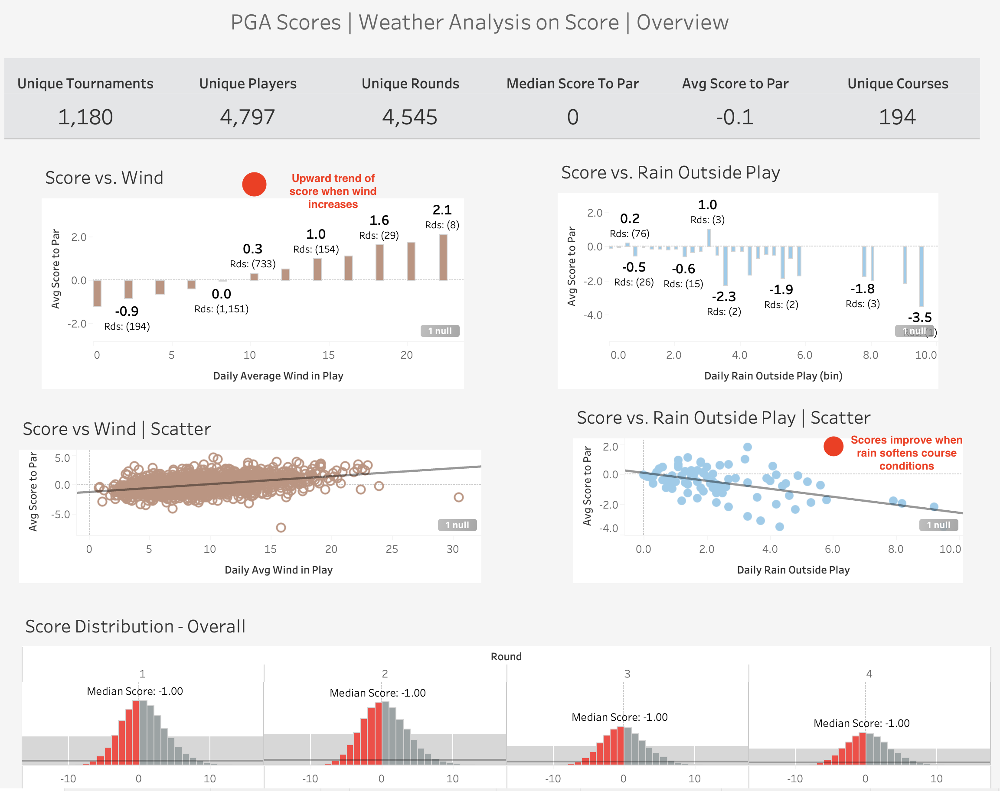
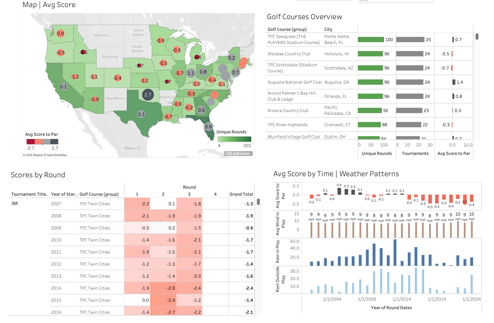
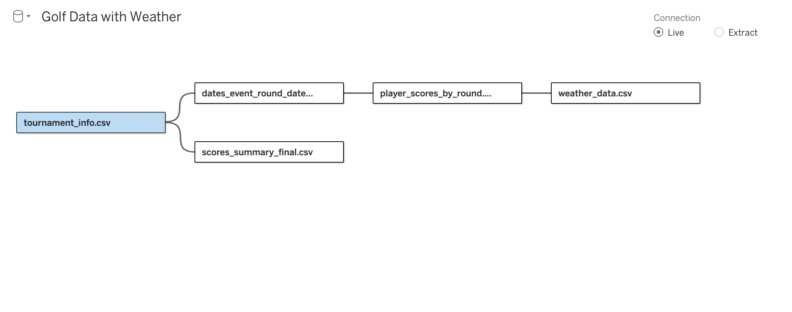
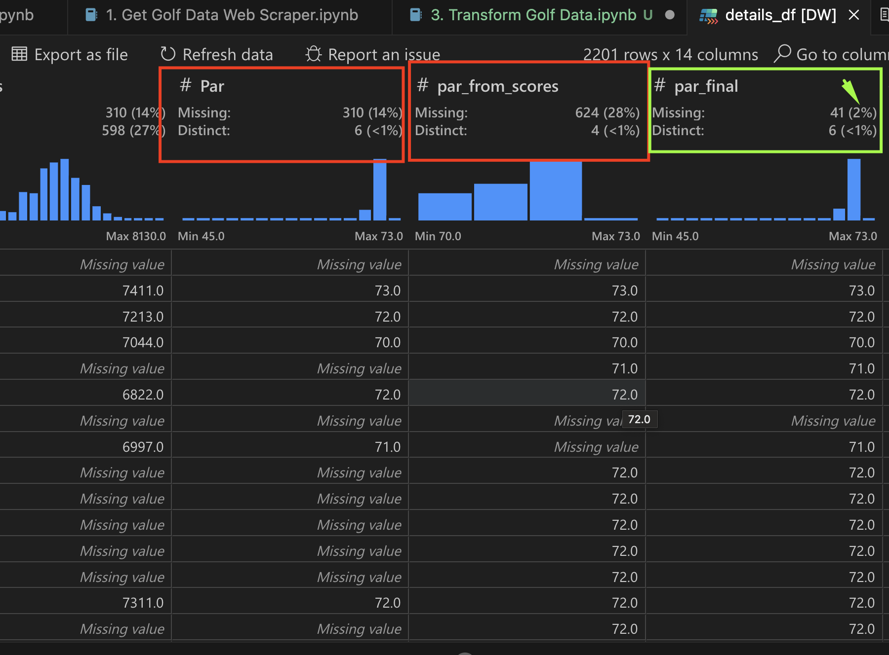

# PGA Tour Golf Data Project | Weather vs. Score

<br>

# Summary & Key Insights
- Scraped PGA tournament scores from 2001 to 2024 and retrieved weather data to understand how weather impacts scores.
- Observed that winds over 20 mph significantly impacted scoring averages.
- Confirmed that wind is the biggest factor.


# Overview
As a golf enthusiast and player, I wanted to see historical golf tournament results to answer questions about weather impacts, course difficulty, player details, and more. This project allowed me to apply data analytical skills to scrape, clean, and build a useful dashboard.

# Goals of Project
1. Compile golf tournament historical records to answer questions like:
    * How does weather impact scores based on wind and rain?
        * Are there courses where we can see differences between years it rained versus not?
        * What are scoring averages in different weather conditions?
    * What courses are the most difficult?

# Dashboard Notes
* EDA was performed and domain knowledge was implemented to remove outliar for data.  For example, wind speeds over 50 mph were excluded, round scores to par were limited in range from -15 to 15+. 

# Dashboard Sample
* Dashboard view to show how weather impacts score overall


* Dashboard view to allow a deeper dive on certain courses, tournaments, and round



# Challenges
1. Golf data API was expensive and had incomplete data.
2. Scraping ESPN was difficult due to changing tournament IDs after 2018.
    * Manual inspection was required to mark tournament ID ranges.
3. Missing data for certain tournaments and fields.
4. Weather data required Selenium Web Crawler and proper packages for ARM architecture.
5. Handling exceptions for web crawlers (timeouts, element interception, stale elements, etc.).
    * Ensuring chromedriver matched chrome version for performance.
    * Observed chromedriver issues after chrome updates.
6. Preparing weather data to consider tournament play weather versus outside tournament time.
7. Ensuring location matched from weather website was in close proximity of golf course location

# Data Model



* A unique tournament will have multiple rounds with many players. For each tournament and round, there will be hourly weather data available.

1. Tournament Info
    * Contains meta data of tournament.
2. Dates Event and Rounds
    * Fact table holding event ID, round number, and date.
3. Player Scores by Round
    * Holds each player's score to par and overall score for a given tournament and round.
4. Weather Data
    * Hourly weather data for a tournament round.

# Script Overviews
1. Get Golf Data Web Scraper
    * Focused on attaining tournament meta data (event date, golf course, tournament name) and player scores.
    * Batches were run based on event ID ranges to scrape ESPN details using Beautiful Soup.

2. Transform Golf Data
    * Cleaned the data of scores and tournament meta data.
    * Key steps:
        1. Removed events with less than 5 players.
        2. Added secondary field for Par of the course using the players' score to par subtracted by their total. This helped improve the fill rate of the Par field.
        
        
        
        3. Performed text cleaning in tournament meta data to get fields like city, yards, par, purse, start/end dates, etc.

3. Get Weather Data - City URL's
    * Leveraged tournament meta data to get base URLs for each tournament city from Weather Underground.
    * Selenium and a web crawler were used to type into JavaScript form fields.
        * Required several try and excepts to resolve interruptions, timeouts, and other bugs.

4. Get Weather Data - Hourly Weather
    * Created specific URLs to get city weather on a desired date.
    * Generated a calendar of dates using the tournament start and end date to create a date for each round.
        * Achieved by creating an array of dates between start and end, then exploding them to get each date at the row level.

        ```python
        def create_array_of_dates(start_date, end_date):
            """
            Creates an array of dates between start_date and end_date.
            """
            try:
                start_date = dt.datetime.strptime(start_date, "%Y-%m-%d")
                end_date = dt.datetime.strptime(end_date, "%Y-%m-%d")
                end_date = end_date + dt.timedelta(days=1)

                date_generated = [start_date + dt.timedelta(days=x) for x in range(0, (end_date-start_date).days)]
                date_generated = [date.strftime("%Y-%m-%d") for date in date_generated]
                return date_generated
            except:
                return None

        df_tournament_details['round_dates'] = df_tournament_details.apply(
            lambda x: create_array_of_dates(x['start_date'], x['end_date']), axis=1
        )

        # Explode the dates to have one row per date
        df_tournament_details = df_tournament_details.explode('round_dates')
        ```
    * Batches were created to troubleshoot erroneous requests and save intermediate data.
    * Selenium used to request the page for each URL created using city and date to store hourly weather data.

5. Transform Hourly Weather - Union and Geopy Distances
    * Unioned the data from all batches.
    * Used GeoPy to assess how close the available weaher data was to the actual tournament city.
    * Dropped weather data where the two cities were more than 35 miles apart.

6. Transform Hourly Weather - Clean Values in Valid Hourly
    * Performed regex text cleaning to convert strings into numerical values for fields like precipitation, wind speed, and temperature.
    * Added numerical hour to each timestamp.
        * Added flag for realistic hours of the day players would be actively playing.

7. Final Transformations - Store Final Data
    * Made final changes to the gold layer for reporting.
        * Required changes observed in Tableau were made in this final notebook.
    * Loaded latest transformed data for weather, tournament meta data, and scores.
    * Created unpivoted scores data table to create relationship for scores and weather data.
    * Created composite keys using event_id and round number to relate round dates, round scores, and weather data.
    * Identified major tournaments and created a flag using manual inspection and fuzzy matches.
    * Added lat/long to city names to aid Tableau in geospatial mapping.

# Packages
* *Created virtual environment for ARM64 architecture for Selenium to be performant*
1. Python 3.7
2. Pandas
3. BeautifulSoup
4. Selenium
5. Re
6. Fuzzywuzzy
7. GeoPy

# Future Roadmap and Enhancements
- Add incremental refresh capability for 2025 tournaments and automate script weekly
- Build a player level dashboard to compare top players performance in certain weather conditions

# Key Troubleshooting Articles
1. How to create env for ARM architecture: 
    https://stackoverflow.com/questions/65415996/how-to-specify-the-architecture-or-platform-for-a-new-conda-environment-apple
2. Root cause for slow Selenium:
    https://stackoverflow.com/questions/76957026/chromedriver-starts-chrome-as-x86-64-translated-on-m1-very-slow-performance   